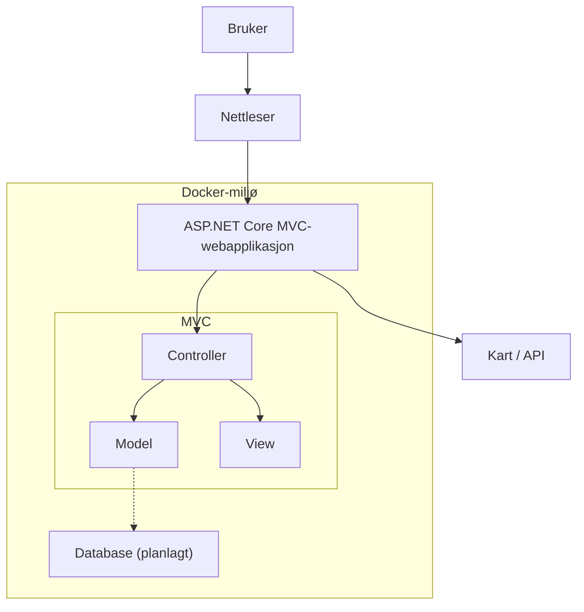

# System arkitektur

For denne webapplikasjonen har vi tatt i bruk MVC rammeverket (Model, View og Controllers). Webapplikasjonen er bygget som en monolittisk løsning, hvor kjernefunksjonaliteten er samlet i en webapplikasjon og kjører som en enhet. Dette gjør at de ulike delene av systemet er samlet i samme prosess, samtidig som webapplikasjonen kan kommunisere med og benytte eksterne tjenester ved behov (Microsoft Learn, 2023). 

## MVC rammeverket og hvordan det henger sammen

MVC rammeverket bestå+r av Models, Views og Controllers, hvor hver del har sitt eget ansvarsområde. Controller fungerer som et bindeledd mellom brukeren og webapplikasjonen. Den mottar forespørsler fra nettleseren, behandler forespørselen og bestemmer hva som skal returneres tilbake til brukeren. Controlleren kan hente eller lagre data gjennom webapplikasjonens datakomponenter før den returnerer et View. 
Et view er det brukeren ser og samhandler med i nettleseren. Det består av HTML markup og dynamisk innhold som sendes til nettleseren. En controller kan returnere en view som viser informasjon til brukeren.
Til sist har vi Model som representerer dataen som brukes i webapplikasjonen. Den kan blant annet inneholde egenskaper for dataene og regler for validering. I webapplikasjonen brukes modeller og viewModels til å overføre og håndtere data mellom ulike deler av systemet.
Sammen gjør disse komponentene at webapplikasjonen får en tydelig struktur, hvor presentasjon, håndtering av forespørsler og data er delt opp i separate deler (Walther, 2022).

## Hvordan data flyter gjennom systemet (eksempel fra koden)
Data flyter gjennom systemet ved at brukeren sender en forespørsel fra nettleseren, dette blir mottatt av Controlleren som behandler den og eventuelt sender eller henter data fra Models eller andre komponenter. Controlleren returnerer deretter en view som presenterer resultatet for brukeren.
Ved innsending av et skjema vil dataen sendes til serveren gjennom en POST forespørsel. Controlleren mottar dataene, behandler og validerer dem før resultatet kan vises til brukeren gjennom et nytt view. Når brukeren fyller ut ResourceEntry og trykker på registrer ressurs knappen, sendes dataene til HomeController gjennom en POST forespørsel. Controlleren mottar dataene gjennom RegisterResource metoden som et ResourceEntry objekt, lagrer ressursen i ResourceStore via ResourceStore.Add(resource), og videresender til index handlingen i ResourceController, som viser listen over ressurser i Resource/index.cshtml. 

## Hvordan bruker, webapplikasjon og eventuelle andre komponenter henger sammen
Systemet består av en bruker som kommuniserer med webapplikasjonen gjennom en nettleser. Webapplikasjonen er utviklet med ASP.NET Core og MVC og håndterer forespørsler, data og visning. Webapplikasjonen har også mulighet til å kommunisere med andre komponenter, som karttjenesten, for å hente og lagre nødvendig informasjon. I den nåværende versjonen lagres data gjennom ResourceStore. En database er planlagt å bli implementert i sprint 2, og vil bli en egen komponent webapplikasjonen kan kommunisere med. 
Webapplikasjonen kjøres i en Docker container. Docker brukes til å pakke webapplikasjonen og dens avhengigheter inn i et isolert miljø, dette gjør at webapplikasjonen kan kjøres på samme måte på ulike maskiner og miljøer (dockerdocs, u.d.). I prosjektet bruker vi Docker til å kjøre webapplikasjonen i containere, og ASP.NET core webapplikasjonen bygges ved hjelp av en Dockerfile. Vi bruker .NET aspire til å starte og administrere webapplikasjonen, dette gjør det enklere å kjøre hele løsningen lokalt.

Slik henger komponentene sammen illustrert med et diagram:
### Systemarkitektur

Slik henger komponentene sammen:

# KI bruk i prosjektet
I prosjektet har vi brukt KI som et hjelpemiddel gjennom ulike deler av utviklingsprosessen. Verktøyene vi har tatt i bruk er blant annet ChatGPT, Copilot og andre ulike KI modeller. Disse har hovedsakelig blitt brukt til å forklare tekniske konsepter innenfor programmering, forstå feilmeldinger, strukturere tekster og videreutvikle ideer til systemets funksjonalitet. Vi har selv vurdert, tilpasset og testet forslagene fra KI før implementasjon. KI har dermed blitt brukt som et støtteverktøy for læring, ideutvikling og problemløsning. 
### Noen prompts vi har brukt aktivt gjennom innleveringen er:

•	Kan du hjelpe oss med å forstå denne feilmeldingen?

•	Kan du forklare denne kodeblokken?

•	Hva er MVC komponenter?

•	Hvorfor vil ikke webapplikasjonen kjøre?

# Bibliografi

dockerdocs. (u.d.). What is Docker? Hentet fra https://docs.docker.com/get-started/docker-overview/ 

Microsoft Learn. (2023, Juli 3). Common web application architectures . Hentet fra https://learn.microsoft.com/en-us/dotnet/architecture/modern-web-apps-azure/common-web-application-architectures 

Walther, S. (2022, November 7). Understanding Models, Views, and Controllers (C#) . Hentet fra https://learn.microsoft.com/en-us/aspnet/mvc/overview/older-versions-1/overview/understanding-models-views-and-controllers-cs  
